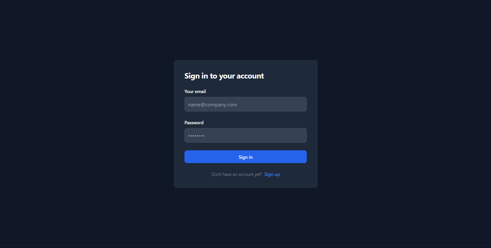
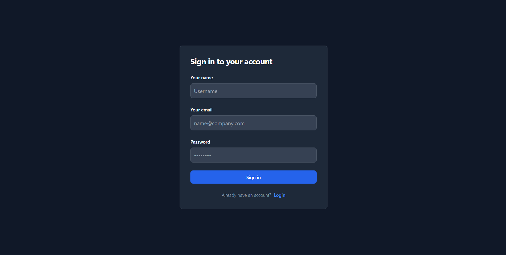
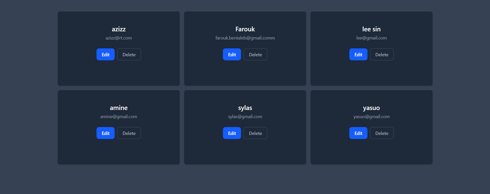

# User Management App

A full-stack user management system built using:

- **Backend:** Node.js, Express
- **Frontend:** React.js, TailwindCSS
- **Features:** User CRUD (Create, Read, Update, Delete), Signup, Login with JWT Authentication

---

## Features

- User registration (Signup) with password hashing
  
- User login with JWT token generation
  
- Protected routes using JWT verification
- CRUD operations on users (create, read, update, delete)
  
- Responsive UI styled with TailwindCSS
- Token stored in localStorage and sent via Authorization headers

---

### Prerequisites

- Node.js (v16+)
- MySQL database
- npm or yarn

### Backend Setup

1. Clone the repo and navigate to backend:
   ```bash
   cd backend
   ```
2. Install dependencies:

```bash
   npm install
```

3. Create a .env file in backend root with your environment variables:

```bash
    ACCESS_TOKEN=your_jwt_secret_key
    DB_HOST=localhost
    DB_USER=root
    DB_PASSWORD=your_password
    DB_NAME=your_database_name

```

4. Run the MySQL schema script (create user table with fields like id, name, email, pwd):

```bash
   CREATE TABLE user (
    id INT PRIMARY KEY AUTO_INCREMENT,
    name VARCHAR(255) NOT NULL,
    email VARCHAR(255) UNIQUE NOT NULL,
    pwd VARCHAR(255) NOT NULL
    );

```

5. Start the frontend and backend servers:

```bash
   npm run start
```
